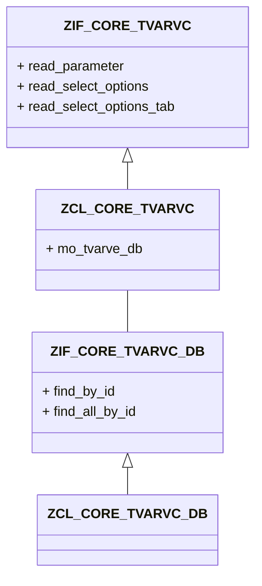

# Class CL_SALV_TABLE with mark option #

[](https://www.sap.com/brazil/developer.html)

Exemplo de utilização de uma classe com a opção de _mark_ no ALV.

```abap
* Declaration

  class-methods on_added_function
    for event if_salv_events_functions~added_function
           of cl_salv_events_table
    importing e_salv_function.
      
```

```abap
* Implementarion

  method process .

    data:
      value type salv_t_row,
      line  type i .

    field-symbols:
      <line> type ty_out .

    case sy-ucomm .

      when 'RUN' .

        if obj->table is bound .

          value = obj->selections->get_selected_rows( ) .

          loop at value into line .

            read table obj->out assigning <line> index line .

            if sy-subrc eq 0 .

              if ( <line>-status is initial ) or
                 ( <line>-status(8) eq '@B_DUMY@' ).
                <line>-status = '@S_OKAY@ Processado.' .
              else .
                <line>-status = '@B_DUMY@ Pendente' .
              endif .

              unassign <line> .

            endif .

          endloop .

          obj->table->refresh( ) .

        endif .

      when others .

    endcase .

  endmethod .                    "link_click
```

```abap

  method on_added_function .

    obj->process( ) .

  endmethod .                    " user_command
```


